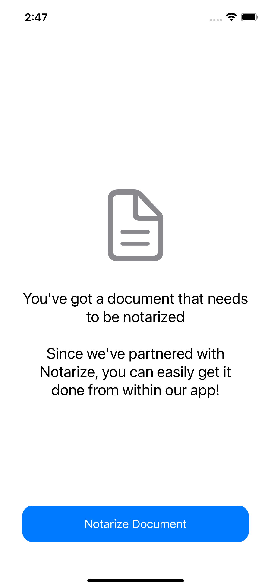

# Notarize iOS SDK Quick Start

> NOTE: The Notarize iOS SDK is currently in closed alpha. If you are interested in using the SDK for your app please contact sales@notarize.com

## Setup

This repository contains example code written in Swift and SwiftUI. In order to run the project, you need to have a full-access [API Key](https://dev.notarize.com/docs/authentication) generated.

As the SDK is still in private alpha, you will also need to download the framework binary (via instructions provided to you) and add it to the project manually. Ensure that "copy items if needed" is checked.

Under the `Frameworks, Libraries, and Embedded Content` in the `General` tab of your target's settings, select the `Embed & Sign` for the NotarizeSigner framework


In addition to embedding the framework, an additional `Framework Search Paths` in the Target's  `Build Settings` is required for our framework to resolve its dependencies:

```
$(PROJECT_DIR)/PATH-TO-FRAMEWORK/NotarizeSigner.framework/Frameworks
```

## Quickstart

### Running the quickstart project

The project contains a convenient networking class for creating transactions via the Notarize API. Ideally, the process of creating transactions and retrieving it's corresponding  `sdk_token` should be done on the server.

Prior to running the app, you need to specify signer details and an API Key in the `ContentView.Swift` file:
```
func getNotarizeSDKToken() {
    // ...
    let signer = SignerRequestInfo(firstName: "<SIGNER_FIRST_NAME>",
                                   lastName: "<SIGNER_LAST_NAME>",
                                   email: "<SIGNER_EMAIL>",
                                   phone: PhoneNumberInfo(countryCode: "<SIGNER_COUNTRY_CODE>",
                                                          number: "<SIGNER_MOBILE_NUMBER>"))
    NotarizeApi.createTransaction(apiKey: "<API_KEY>", signer: signer)
        .receive(on: DispatchQueue.main)
        .sink { completion in
            switch completion {
            case .failure(let error):
                debugPrint("an error occurred \(error.localizedDescription)")
                self.loading = false
            case .finished:
                break
            }
        } receiveValue: { sdkToken in
            self.loading = false
            self.activeSheet = .notarization(token: sdkToken)
        }
        .store(in: &cancellables)
}
```
The above code will generate a transaction using the `API Key`, and retrieve an `sdk_token` which is used to instantiate a signing flow using the NotarizeSigner framework.

Run the app on a device or simulator



Tapping on the Notarize Document should load the token and launch the experience.

The NotrizeSigner framework provides the capability to respond to results from the signing experience. This can be done via the `SigningResultCallback` parameter when building the signing viewcontroller:
```
let controller = NotarizeSigner.buildSigning(token: token) { (result) in
    switch result {
    case .signingCompleted(let context):
        debugPrint("notarization has completed.")
    case .userCancelled:
        debugPrint("user has exited the flow prior to completion")
    case .notaryTerminated:
        debugPrint("notary was unable to complete the notarization due to missing requirements")
    case .error(let error):
        debugPrint("a non recoverable error has occurred during the signing process")
    }
}
```

### Troubleshooting

Depending on your project settings, you may need to set `Validate Workspace` setting in the target's `Build Settings` to `YES`

When running on a physical device, you could potentially experience a crash due to code signing inconsistencies. To solve this issue, insure that that the project's `Build Phases` has a run script after the `Embed Frameworks` step that runs the following:
```
pushd ${TARGET_BUILD_DIR}/${PRODUCT_NAME}.app/Frameworks/NotarizeSigner.framework/Frameworks
for EACH in *.framework; do
    echo "-- signing ${EACH}"
    /usr/bin/codesign --force --deep --sign "${EXPANDED_CODE_SIGN_IDENTITY}" --entitlements "${TARGET_TEMP_DIR}/${PRODUCT_NAME}.app.xcent" --timestamp=none $EACH
done
popd

```
